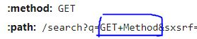
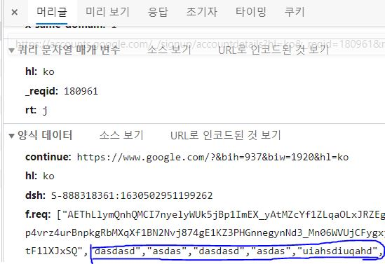

# Network

## OSI 7 계층

> 개방형 시스템 상호 연결을 위한 기초 참조 모델 Open Systems Interconnection Reference Model)

국제표준화기구(ISO)에서 개발한 모델로, 컴퓨터 네트워크 프로토콜 디자인과 통신을 계층으로 나누어 설명한 것이다. 즉 네트워크에서 통신이 일어나는 과정을 7단계로 나눈 것이다.

물리 - 데이터 링크 - 네트워크 - 전송 - 세션 - 표현 - 응용 계층으로 구성되며, 나누어진 계층 모델별로 프로토콜이 구성된다.

_**WHY?**_ OSI 7 계층으로 나누어 통신이 일어나는 과정을 단계별로 알 수 있고, 7단계 중 특정한 곳에 이상이 생기면 다른 단계와 독립적으로 그 단계를 수정할 수 있다. OSI 7계층은 현재의 네트워크 시스템의 기반이 되어 다양한 시스템은 이 계층 모델을 기반으로 통신한다. 현재의 인터넷은 TCP/IP 4계층 모델__링크, 인터넷, 전송, 응용_ 을 기반으로 한다.

### 프로토콜

프로토콜은 메시지를 주고 받는 양식/규칙을 의미하는 통신 규약이다.

시스템 간에 메시지를 주고 받기 위해서는 한쪽에서 보낸 메시지를 반대쪽에서 이해할 수 있어야 한다. 그러기 위해서는 메시지를 주고 받으며 통신할 때 그 언어와 대화 방법에 대해 미리 정해진 규칙이 있어야 의사소통을 할 수 있을 것이다. 이 규칙을 정의한 것이 프로토콜이고 이 규칙은 계층별로 다르게 존재한다.

## GET과 POST

대표적인 HTTP 메서드인 GET과 POST이다. 두 방식 모두 HTTP 프로토콜을 이용하여 서버에 어떤 것을 요청할 때 사용한다. 그러나 이런 요청이 왜 GET, POST 등 다른 방식으로 세분화 되어있는지를 이해하여 기술의 목적에 맞게 알맞은 용도로 사용해야 한다.

### GET 

GET 방식은 요청하는 데이터가 `HTTP Request Message` 의 Header 부분에 url이 담겨 전송된다. 때문에 url상에 `?` 뒤에 데이터가 붙어 request를 보내게 된다. 이러한 방식은 url 이라는 공간에 담겨가기 때문에 전송할 수 있는 데이터의 크기가 제한적이다. 또 보안이 필요한 비밀번호와 같은 데이터에 대해서는 데이터가 그대로 노출되므로, 적절하지 않다.

> google에서 `GET Method` 로 검색한 결과의 요청 헤더 중 일부

### POST

POST 방식의 request는 `HTTP Request Message`  의 Body 부분에 데이터가 담겨서 전송된다. 따라서 바이너리 데이터를 요청하는 경우 POST 방식으로 보내야 하는 것처럼 다룰 수 있는 데이터의 크기가 GET 방식보다 크며, 보안면에서 낫다 (**어떤 면에서, 왜 나은 지?**). 하지만 보안에 대해서는 암호화를 하지 않는 이상 크게 차이가 나지 않는다.

> 대표적인 POST 요청인 회원가입시 Request Body 내부에서 입력한 이름과 아이디를 확인할 수 있다.

특성에 대해 알아보았으니, 어떻게 사용되는지를 알아보자. 우선 GET은 서버의 값/상태 등을 변경하기 위한 요청이 아닌, 서버에서 특정 데이터를 가져오기 위한 방식이다. 반면 POST는 서버의 값/상태를 변경/추가하기 위해 사용된다. 덧붙이자면 REST API 설계를 따르자면 `Delete`  등 조금 더 세분화된 메서드를 사용할 필요가 있다.

또한 GET 방식의 요청은 브라우저에서 자체적으로 Caching할 수 있다. 만약 데이터의 크기나 보안적인 이유가 없어 POST 방식으로 보낼 요청을 GET 방식으로 보내게 된다면, 기존에 Caching된 데이터가 응답될 수도 있다는 뜻이다.

# TCP와 UDP

### UDP

`UDP(User Datagram Protocol, 사용자 데이터그램 프로토콜)` 는 비연결형 프로토콜이다. IP 데이터그램을 캡슐화하여 보내는 방법과 연결 설정을 하지 않고 보내는 방법을 제공한다. UDP는 흐름제어, 오류제어 또는 손상된 세그먼트의 수신에 대한 재전송을 하지 않는다. 이 모두가 사용자 프로세스의 몫이며, UDP가 행하는 것은 포트들을 사용하여 IP프로토콜에 인터페이스를 제공하는 것이다.

종종 클라이언트는 서버로 짧은 요청을 보내고, 짧은 응답을 기대한다. 만약 요청 또는 응답이 손실된다면, 클라이언트는 time out되고 다시 시도할 수 있으면 된다. 코드가 간단할

UDP를 사용한 것들 중에는 DNS가 있다. 어떤 호스트 네임의 IP 주소를 찾을 필요가 있는 프로그램은, DNS 서버로 호스트네임을 포함한 UDP 패킷을 보낸다. 이 서버는 호스트의 IP주소를 포함한 UDP 패킷으로 응답한다. 사전에 설정이 필요하지 않으며, 기 후에 해제가 필요하지 않다.