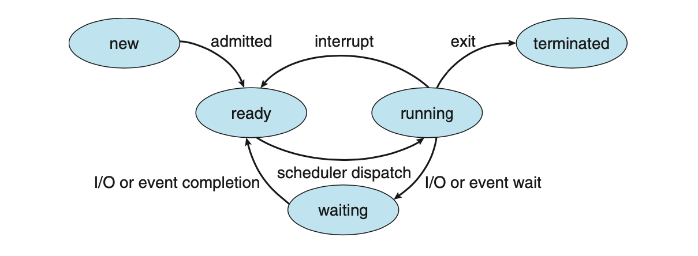

# 운영체제

## 프로세스와 스레드

### 프로세스 Process

프로세스는 실행 중인 프로그램으로 디스크로부터 메모리에 적재되어 CPU의 할당을 받을 수 있는 것을 말한다. 운영체제로부터 주소 공간, 파일, 메모리 등을 할당받으며 이것들을 총칭하여 프로세스라고 한다. 구체적으로 프로세스는 함수의 매개변수, 복귀 주소와 로컬 변수와 같은 임시 자료를 갖는 프로세스 스택과 전역 변수들을 수록하는 데이터 섹션을 포함한다. 또한 프로세스는 프로세스 실행 중 동적으로 할당되는 메모리입 힙을 포함한다.

##### 프로세스에 할당되는 메모리 영역

- Code : 프로세스가 실행할 코드가 기계어의 형태로 저장된 공간이다. Read-Only이다.
- Data : 전역 변수, static 변수등이 저장된 공간이다. 전역 변수, static 변수를 참조한 코드는 컴파일하고 나면 데이터 영역의 주소값을 가르킨다. 프로그램의 시작과 함께 할당되며, Read-Write이다.
  - Read-Write : 실행 도중 변경 가능
- Heap : 프로그래머가 관리하는 메모리 영역으로, 힙 영역에 메모리를 할당하는 것을 동적 할당이라고 한다. 런타임에 결정되며, Stack보다 할당할 수 있는 메모리 공간이 많으나 데이터의 읽기/쓰기가 상대적으로 느리다.
- Stack : 함수 안에서 선언된 지역변수, 매개변수, 리턴 값, 복귀 주소등이 저장된다. 스택의 LIFO 방식에 따라 함수 호출 시 기록하고 종료되면 제거한다. 컴파일 타임에 결정되며, 정해진 크기 초과시 stack overflow 에러가 발생할 수 있다.

> [런타임이란? 컴파일타임 과의 차이는? (tistory.com)(https://spaghetti-code.tistory.com/35)
>
> 개발자는 컴파일이라는 과정을 통해 소스코드를 기계어코드로 변환하여 실행 가능한 프로그램으로 만들 수 있다. 이 시기를 컴파일타임이라고 칭한다. 컴파일을 마친 프로그램은 사용자에 의해 실행되며, 응용프로그램이 동작되어지는 때를 런타임이라고 칭한다

궁금증) C로 작성된 소스코드는 컴파일되어 설치 프로그램 내부에 적재된 후 내 컴퓨터에서 설치되고 실행되는 것일까?

궁금증) Vue 프레임워크를 활용한 웹 개발 중 `npm run serve` 를 하면 내 코드가 컴파일되는 과정을 거친 후 실행되는 것일까?

#### 프로세스 제어 블록 Process Control Block, PCB

PCB는 특정 프로세스에 대한 중요한 정보를 저장하고 있는 운영체제의 자료구조이다. 운영체제는 프로세스를 관리하기 위해 프로세스의 생성과 동시에 고유한 PCB를 생성한다. 프로세스는 CPU를 할당받아 작업을 처리하다가도 프로세스 전환이 발생하면 진행하던 작업을 저장하고 CPU를 반환해야 하는데, 이때 작업의 진행 상황을 모두 PCB에 저장하게 된다. 다시 CPU를 할당받게 되면, PCB에 저장되어 있던 내용을 불러와 이전에 종료됐던 시점부터 다시 작업을 수행한다.

##### PCB에 저장되는 정보

- 프로세스 식별자 PID : 프로세스 식별번호
- 프로세스 상태 : new, ready, running, waiting, terminated 등의 상태를 저장
- 프로그램 카운터 : 프로세스가 다음에 실행할 명령어의 주소
- CPU 레지스터 : Accumulator, Index Register, 범용 레지스터 등이라는데 정확히 뭔지 모르겠다.
- CPU 스케쥴링 정보 : 페이지 테이블 또는 세그먼트 테이블 등과 같은 정보를 포함
- 입출력 상태 정보 : 프로세스에 할당된 입출력 장치들과 열린 파일 목록
- 어카운팅 정보 : 사용된 CPU 시간, 시간제한, 계정번호 등

### 쓰레드 Thread

쓰레드는 프로세스를 구성하는 독립적인 실행 단위이다. 한 프로세스 내에서 동작되는 여러 실행 흐름을 말하며, 프로세스 내의 주소 공간이나 자원을 공유할 수 있다. 

쓰레드는 고유한 쓰레드 ID, 프로그램 카운터, 레지스터 집합, 스택으로 구성된다. 또한 쓰레드가 속한 프로세스 내의 코드/데이터/힙 영역 및 기타 운영체제 자원(열린 파일, 신호 등)을 다른 쓰레드와 공유한다.

각 쓰레드는 스택 영역과 PC 레지스터를 통해 독립적인 실행 흐름을 가진다. 

- 스택 영역 : 함수 호출 시 전달되는 인자, 되돌아갈 주소값 및 함수 내에서 선언하는 변수 등을 저장하기 위해 사용되는 메모리 공간이다. 개별 쓰레드가 독립적인 스택 메모리 공간을 가진다는 것은 독립적인 함수 호출이 가능하다는 것이다. 이는 쓰레드의 최소 조건인 독립적인 실행 흐름이 가능해지는 것이므로 개별 쓰레드는 독립된 스택을 할당받는다.
- PC REGISTER : 쓰레드가 명령어의 어디까지 수행하였는지를 나타낸다. 쓰레드의 경우에는 CPU 를 할당받았다가 스케쥴러에 의해 다시 선점당한다. 따라서 명령어가 연속적으로 수행되지 못하고 어느 부분까지 수행했는지를 기억할 필요가 있어 PC 레지스터를 독립적으로 할당한다.

쓰레드는 프로세스의 메모리 영역을 공유하기 때문에, 어떤 쓰레드 하나에서 오류가 발생하면 같은 프로세스 내의 다른 쓰레드 모두가 강제 종료된다. 프로세스가 강제 종료되더라도 특별한 경우가 아니라면 다른 프로세스에 영향을 주지 않는 것과 비교할 수 있다.

## 멀티 프로세스와 멀티 쓰레드

### 동시성

##### Concurrent Vs. Parallel

- Concurrent : 어떤 Job 여러 개가 동시에 처리된다는 개념
- Parallel : 어떤 하나의 Job을 쪼개서 여러 sub-job으로 나누고, 물리적으로 분리된 구조에서 동시에 처리하여 완성하는 개념 ( 분업, CPU의 멀티코어 )

멀티 프로세서 구조가 발전하기 전에는 싱글 프로세서로 재빠르게 프로세스를 전환하여 실제로는 Concurrent하게 동작하지만, Parallel하게 동작하는것 처럼 보이도록 했었다.

#### 컨텍스트 스위칭 Context Switching

CPU 코어를 다른 프로세스로 전환하기 위해 현재 프로세스의 상태 저장 및 다른 프로세스의 상태 복원을 수행하는 작업을 말한다.

- Context : CPU가 프로세스를 실행하기 위한 정보. PCB에 저장되는 정보들이 해당된다.

Context Switching이 발생하면 커널이 이전 프로세스의 Context를 해당 프로세스의 PCB에 저장한다. 이후 스케쥴링으로 예약된 다음 프로세스의 저장된 Context를 불러온다.

- 이때 Context Switching을 수행 중에는 CPU의 자원이 어떤 프로세스에 할당된 상태가 아니기 때문에 CPU가 작업을 할 수 없다. 따라서 Context Switching Time은 순수한 Overhead이다.

#### 멀티 프로세스 Multi Process

여러 개의 프로세스를 동시에 수행하는 것이다.

- 프로세스는 부모-자식 관계여도 자신만의 메모리 영역을 가지게 되며, 공유되는 메모리 영역 없이 독립적인 구조를 가진다.

##### 크롬 브라우저의 멀티 프로세스 구조

대부분의 브라우저는 탭 브라우징을 지원한다. 이때 브라우저가 멀티 프로세스 구조를 가지지 않는다면, 어떤 탭의 웹 어플리케이션이 비정상 종료되면 모든 탭을 포함한 전체 프로세스가 종료될 것이다.

크롬 브라우저는 멀티 프로세스 구조를 가지고 있다. 브라우저의 각 탭은 Renderer 프로세스이며, 각자 독립적으로 실행된다. 하나의 웹 사이트가 비정상 종료되어도 다른 Renderer 프로세스는 영향을 받지 않는다.

크롬은 다음 3가지 유형의 프로세스를 지원한다.

- Brower Process : 사용자 인터페이스와 디스크 및 네트워크 I/O를 관리. 크롬이 시작되면 새 브라우저 프로세스가 생성된다.
- Renderer Process: 웹 페이지 렌더링을 위한 로직(HTML, JS, Image 등을 처리)을 포함한다. 새 탭에 대해 새 Renderer 프로세스가 생성되므로 여러 프로세스가 동시에 활성화될 수 있다.
-  Plugin Process : Flash/QuickTime과 같은 각 플러그인 유형에 대해 플러그인 프로세스가 생성된다. 플러그인 프로세스에는 플러그인에 대한 코드와 연관된 Renderer, Browser Process와 통신할 수 있도록 하는 추가 코드가 포함되어 있다.

##### 멀티 프로세스의 통신 방법

독립적인 메모리 영역을 가지는 프로세스이지만, 서로 통신하는 방법이 있다. 데이터를 교환하기 위한 IPC(Inter-Process Communication) 메커니즘이다. IPC에는 공유 메모리/메시지 전달의 두 가지 모델이 있다.

- Shared Memory : 프로세스가 공유하는 메모리 영역이 설정되며, 각 프로세스는 공유 영역에서 데이터를 읽고 쓰는 방식으로 정보를 교환할 수 있다.
- Message Passing : 프로세스 간 메시지를 교환하며 통신한다.

##### 멀티 프로세스의 장점

- 독립된 구조로 안정성이 높다.
- 하나의 프로세스가 비정상적으로 종료되어도 자식 프로세스 이외의 다른 프로세스들은 이무런 영향을 받지 않는다.

##### 멀티 프로세스의 단점

- 독립된 메모리 영역을 가지고 있기 때문에 Context Switching을 위한 오버헤드(캐시 초기화 등)가 발생한다.
- 빈번한 Context Switching은 성능 저하를 유발할 수 있다.

##### 멀티 쓰레드를 적용한 어플리케이션의 예시

- 웹 서버 프로세스
  - 클라이언트의 요청을 처리하기 위한 별도의 쓰레드를 생성한다.
    - 새 프로세스를 생성하는 것보다 비용적인 측면에서 훨씬 효율적이다.

- 운영체제의 커널
  - Linux 시스템 부팅 시 여러 커널 쓰레드가 생성된다. 각 쓰레드는 장치 관리, 메모리 관리 또는 인터럽트 처리와 같은 특정 작업을 수행한다.
    - `ps -ef` 명령어를 사용하여 실행 중인 Linux 시스템에서 커널 쓰레드를 표시할 수 있다.

- 이미지의 모음에서 사진 썸네일을 생성하는 어플리케이션
  - 별도의 쓰레드를 사용하여 각각의 개별 이미지에서 썸네일을 생성할 수 있다.

- 웹 브라우저
  - 하나의 쓰레드에서는 이미지나 텍스트를 보여주고, 다른 쓰레드에서는 네트워크를 통해 데이터를 검색할 수 있다.

- 워드 프로세서
  - 그래픽을 표시하기 위한 쓰레드, 키 입력에 응답하기 위한 쓰레드, 백그라운드에서 맞춤법/문법 검사를 수행하기 위한 쓰레드를 가질 수 있다.

##### 멀티 쓰레드의 장점

- 응답성이 좋아진다. 
  - 단일 쓰레드를 사용하면 작업이 완료될 때까지 응답을 기다려야 하지만, 멀티 쓰레드로 작업을 나누어 응답성을 향상시킬 수 있다.
- 자원을 공유할 수 있다. 
  - 프로세스는 공유 메모리/메시지 전달같은 기술을 통해야 자원을 공유할 수 있지만, 쓰레드는 기본적으로 프로세스의 자원을 공유하므로 동일한 주소 공간 내에서 여러 쓰레드를 가질 수 있다.
- 비용이 적다. 
  - 쓰레드는 자신이 속한 프로세스의 자원을 공유하므로 쓰레드 생성과 Context Switching 비용이 더 적다.

##### 멀티 쓰레드의 단점

- 자원의 공유
  - 쓰레드 하나에서 오류가 발생하면 같은 프로세스 내의 모든 쓰레드가 종료될 수 있다.
  - 공유 자원에 대한 동기화 문제 또한 고려해야 한다.

## 프로세스 스케줄링

프로세스 스케줄러는 멀티 프로그래밍과 time sharing의 목적을 달성하기 위해 실행 가능한 여러 프로세스 중에서  하나의 프로세스를 선택해 실행한다. 각 CPU 코어는 한 번에 한 프로세스를 실행할 수 있다. 따라서 단일 CPU 코어 시스템에 반해 멀티 코어 시스템은 한 번에 여러 프로세스를 실행할 수 있다.

- 멀티 프로그래밍 : CPU 사용률을 최대화하기 위해 항상 프로세스를 실행하도록 한다. 어떤 프로세스가 CPU를 사용하다가 I/O 작업 등 CPU를 필요로 하지 않는 순간이 오면 다른 프로세스가 CPU를 사용할 수 있도록 한다.
- 시분할 time sharing : 각 프로그램이 실행되는 동안 사용자들이 상호작용할 수 있도록 프로세스 간 CPU 코어를 자주 전환하는 것이다. CPU가 하나의 프로그램을 수행하는 시간을 매우 짧은 시간으로 제한하여  프로그램을 번갈아 수행하도록 하면, CPU가 하나인 환경에서도 여러 사용자가 동시에 사용하는 듯한 효과를 가져올 수 있다.

#### 프로세스 상태

- New : 프로세스가 생성됨
- Running : 프로세스의 Instruction이 실행됨
- Waiting : I/O 작업 완료나 신호 수신과 같은 이벤트가 발생하기를 기다림
- Ready : 프로세서에 할당되기를 기다림
- Terminated : 프로세스가 실행을 끝냄

#### 스케줄링 큐

- Job Queue : 현재 시스템 내에 있는 모든 프로세스의 집합

- Ready Queue : 현재 메모리 내에 있으면서 CPU를 기다리는 프로세스의 집합
  - Linked List 형태로 저장되며, ready queue의 header는 list의 첫 번째 PCB를 가리키고, 각 PCB의 포인터는 ready queue에 있는 다음 PCB를 가리킨다.
- I/O Wait Queue (Device Queue) : I/O 요청과 같은 특정 이벤트가 처리 완료되기까지를 기다리는 프로세스가 wait queue에 배치된다. 
  - 프로세스는 waiting 상태에서 ready상태로 바뀌면 ready queue에 들어가게 된다.

프로세스가 종료되면 모든 큐에서 제거되고 PCB 및 자원 할당이 해제된다.

### 프로세스 스케줄러

각각의 queue에 프로세스를 넣고 빼주는 스케줄러에도 크게 세 가지 종류가 존재한다.

#### 장기스케줄러 Job Scheduler

많은 프로세스들이 한꺼번에 메모리에 올라올 경우, 메모리는 한정되어 있기에 대용량 메모리(주로 HDD)에 임시로 저장된다. 장기 스케줄러는 이 pool에 저장되어 있는 프로세스 중 어떤 프로세스에 메모리를 할당하여 ready queue로 보낼지 결정하는 역할을 한다.

- 메모리와 디스크 사이의 스케줄링 담당
- 프로세스에 메모리 및 각종 리소스를 할당 (admit)
  - 프로세스의 상태는 'new'에서 'ready'가 된다.
- Degree of MultiProgramming 제어 (실행중인 프로세스의 수 제어)

메모리에 너무 많이 올라가도, 너무 적게 올라가도 성능이 좋지 않은 것이다. Time Sharing System에서는 장기 스케줄러 없이 곧바로 메모리에 올라가 ready 상태가 된다.

- Time Sharing System : 한 컴퓨터를 여러 사용자가 동시에 사용하는 경우, 사용자들이 CPU의 시간 자원을 나누어 사용하는 것. ≓ 다중사용자 지원환경
  - PC, 워크스테이션을 제외한 대부분의 메인프레임 등이 이 방식이다. 멀티태스킹과 비슷하지만 멀티태스킹은 한 사용자가 여러 작업을, 시분할은 한 컴퓨터를 여러 사용자가 이용하는 것이다.

#### 단기스케줄러 CPU Scheduler

CPU 스케줄링은 Ready Queue에 있는 프로세스들을 대상으로 이루어진다.

- CPU와 메모리 사이의 스케줄링 담당
- Ready Queue에 존재하는 프로세스 중 어떤 프로세스를 실행시킬 지 결정
- 프로세스에 CPU를 할당 (scheduler dispatch)
  - 프로세스의 상태는 'ready' - 'running' - 'wating' - 'ready' 를 반복한다. (첨부그림 참조)

#### 중기스케줄러 Swapper

- 메모리에 여유 공간 마련을 위해 프로세스를 통째로 메모리에서 디스크로 쫓아냄 (swapping)
  - 프로세스의 메모리를 deallocate
  - Degree of MultiProgramming 제어
  - 현 시스템에서 메모리에 너무 많은 프로그램이 동시에 올라가는 것을 조절
  - 프로세스의 상태는 'ready'에서 'suspended'가 된다.
    - Suspended (stopped) : 외부적인 이유로 프로세스의 수행이 정지된 채 메모리에서 내려간 상태를 의미한다. 프로세스 전부 디스크로 swap out된다.  
      - 'blocked' 상태는 다른 I/O 작업을 기다리는 상태로 스스로 'ready'로 돌아갈 수 있지만, 'suspended'는 외부적인 이유이므로 스스로 돌아갈 수 없다.

## CPU 스케줄러

위에서 살펴본 단기 스케줄러를 자세히 살펴보자.

#### 선점 / 비선점 스케줄링 Preemptive VS. Non-Preemptive

 CPU 스케줄링은 4가지 상황에 대해 발생한다.

1. 'running' => 'wating' 상태로 전환 e.g.) I/O 요청 or 하위 프로세스 종료를 위한 wait() 호출
2. 'running' => 'ready' 상태로 전환 e.g.) interrupt 발생
3. 'wating' => 'ready' 상태로 전환 e.g.) I/O 완료
4. 프로세스 종료

1번과 4번 상황에서는 선택권 없이 새 프로세스를 선택해야 한다. 하지만 2, 3번 상황에서는 다음과 같은 선택권이 있다.

궁금한 점 : 1, 4번은 왜 선택권이 없이 새 프로세스를 선택해야 하는가?

- 비선점 스케줄링 : CPU가 할당된 어떤 프로세스가 종료 / 'wating' 상태로 전환하여 CPU를 해제할 때까지 CPU를 유지하고, 다른 프로세스는 그때까지 CPU를 사용할 수 없다.
- 선점 스케줄링 : 어떤 프로세스가 CPU를 점유하고 있을 때 다른 프로세스가 CPU를 선점할 수 있다. Windows, Mac, Linux 및 UNIX를 포함한 거의 모든 최신 운영체제는 선점 스케줄링 알고리즘을 사용한다.

국어적으로 선점 스케줄링이 CPU를 선점한 프로세스가 CPU를 놓지 않는 것처럼 생각했는데 그것의 반대였다. 선점보다는 다른 좋은 용어가 있을 것 같다는 생각이 들었다...

#### 스케줄링 알고리즘

##### FCFS, First-Come First-Served

비선점 스케줄링

- 먼저 도착한 프로세스에 CPU가 할당 => FIFO Queue로 쉽게 구현할 수 있다.
- 비선점형이기에 프로세스가 CPU를 잡기만 하면 CPU burst가 완료될 때까지 CPU를 반환하지 않는다. 할당되었던 CPU가 반환될 때만 스케줄링이 이루어진다.
  - CPU burst : 연속적으로 CPU를 사용하는 시간.

문제점

- Convoy Effect : 소요시간이 긴 프로세스가 먼저 CPU를 요청했을 때, 더 짧은 프로세스들이 먼저 진행되며 I/O 요청을 하는 등의 경우보다 장치 이용률이 낮아지는 현상이다.

##### SJF, Shortest-Job-First

비선점 스케줄링

- 다른 프로세스가 먼저 도착했어도 CPU burst time이 짧은 프로세스에 우선 할당한다.
  - 궁금증 : 여기서 '도착' 이라는 것은 'ready queue'에 도착했다는 것일까?
- 최소 평균 대기시간에는 최적의 알고리즘이다. 하지만 CPU burst time을 알 수 있는 방법이 없으므로 이전 CPU burst time 지수 평균으로 대신 예측하는 방법이 있다.

문제점

- Starvation : CPU burst time이 긴 프로세스는 계속해서 ready queue의 뒷편으로 밀려날 수 있고, 무한정 기다리기만 하는 상황이 올 수도 있다.

##### Priority Scheduling

선점/비선점 스케줄링

- 정수로 표현된 우선순위가 더 높은 프로세스에 CPU를 할당하는 스케줄링이다. 내부적/외부적 우선순위로 나눌 수 있다.
  - 내부적 : 시간 제한, 메모리 요구 사항, 열린 파일 수, 평균 I/O burst 대 평균 CPU burst  비율 등 측정 가능한 수량으로 계산
  - 외부적 : 프로세스의 중요성, 기타 정치적 요인 등
    - 궁금증 : 기타 정치적 요인이란 무엇일까?
- 선점/비선점 스케줄링이 모두 가능하다.
  - 선점 : 새로 도착한 프로세스의 우선 순위가 현재 실행중인 프로세스의 우선 순위보다 높으면 CPU 선점
  - 비선점 : 위와 같은 경우 단순히 새로 들어온 프로세스를 ready queue의 맨 앞에 둔다.

문제점

- Indefinite Blocking : 실행할 준비는 되었으나 CPU를 기다리는 프로세스는 block된 것으로 간주될 수 있다.
- Starvation

해결책

- Aging : 오랫동안 대기하는 프로세스의 우선순위를 점진적으로 높여 해결할 수 있다. e.g.) 대기 중인 프로세스의 우선 순위를 매초 늘리는 식.
- Round-Robin과 결합 : Priority Scheduling을 하되, 동일한 우선순위의 프로세스에 대해서는 Round-Robin 방식을 적용한다.
