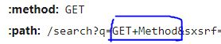
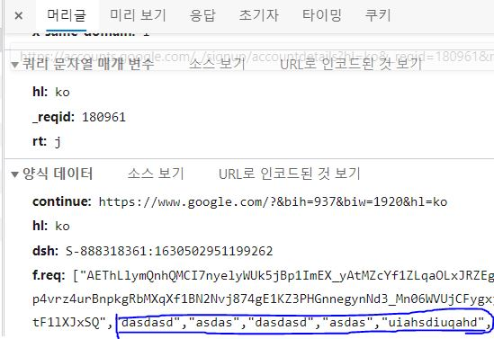

# Network

### OSI 7 계층

> 개방형 시스템 상호 연결을 위한 기초 참조 모델 Open Systems Interconnection Reference Model)

국제표준화기구(ISO)에서 개발한 모델로, 컴퓨터 네트워크 프로토콜 디자인과 통신을 계층으로 나누어 설명한 것이다. 즉 네트워크에서 통신이 일어나는 과정을 7단계로 나눈 것이다.

물리 - 데이터 링크 - 네트워크 - 전송 - 세션 - 표현 - 응용 계층으로 구성되며, 나누어진 계층 모델별로 프로토콜이 구성된다.

_**WHY?**_ OSI 7 계층으로 나누어 통신이 일어나는 과정을 단계별로 알 수 있고, 7단계 중 특정한 곳에 이상이 생기면 다른 단계와 독립적으로 그 단계를 수정할 수 있다. OSI 7계층은 현재의 네트워크 시스템의 기반이 되어 다양한 시스템은 이 계층 모델을 기반으로 통신한다. 현재의 인터넷은 TCP/IP 4계층 모델__링크, 인터넷, 전송, 응용_ 을 기반으로 한다.

### 프로토콜

프로토콜은 메시지를 주고 받는 양식/규칙을 의미하는 통신 규약이다.

시스템 간에 메시지를 주고 받기 위해서는 한쪽에서 보낸 메시지를 반대쪽에서 이해할 수 있어야 한다. 그러기 위해서는 메시지를 주고 받으며 통신할 때 그 언어와 대화 방법에 대해 미리 정해진 규칙이 있어야 의사소통을 할 수 있을 것이다. 이 규칙을 정의한 것이 프로토콜이고 이 규칙은 계층별로 다르게 존재한다.

## GET과 POST

대표적인 HTTP 메서드인 GET과 POST이다. 두 방식 모두 HTTP 프로토콜을 이용하여 서버에 어떤 것을 요청할 때 사용한다. 그러나 이런 요청이 왜 GET, POST 등 다른 방식으로 세분화 되어있는지를 이해하여 기술의 목적에 맞게 알맞은 용도로 사용해야 한다.

### GET 

GET 방식은 요청하는 데이터가 `HTTP Request Message` 의 Header 부분에 url이 담겨 전송된다. 때문에 url상에 `?` 뒤에 데이터가 붙어 request를 보내게 된다. 이러한 방식은 url 이라는 공간에 담겨가기 때문에 전송할 수 있는 데이터의 크기가 제한적이다. 또 보안이 필요한 비밀번호와 같은 데이터에 대해서는 데이터가 그대로 노출되므로, 적절하지 않다.

> google에서 `GET Method` 로 검색한 결과의 요청 헤더 중 일부

### POST

POST 방식의 request는 `HTTP Request Message`  의 Body 부분에 데이터가 담겨서 전송된다. 따라서 바이너리 데이터를 요청하는 경우 POST 방식으로 보내야 하는 것처럼 다룰 수 있는 데이터의 크기가 GET 방식보다 크며, 보안면에서 낫다. 하지만 보안에 대해서는 암호화를 하지 않는 이상 크게 차이가 나지 않는다.

- url 표시줄에 나타나느냐 여부 정도의 차이가 있으며, 요청을 뜯어보게 되면 보안성에 큰 차이는 없다는 뜻.  

> 대표적인 POST 요청인 회원가입시 Request Body 내부에서 입력한 이름과 아이디를 확인할 수 있다.

특성에 대해 알아보았으니, 어떻게 사용되는지를 알아보자. 우선 GET은 서버의 값/상태 등을 변경하기 위한 요청이 아닌, 서버에서 특정 데이터를 가져오기 위한 방식이다. 반면 POST는 서버의 값/상태를 변경/추가하기 위해 사용된다. 덧붙이자면 REST API 설계를 따르자면 `Delete`  등 조금 더 세분화된 메서드를 사용할 필요가 있다.

또한 GET 방식의 요청은 브라우저에서 자체적으로 Caching할 수 있다. 만약 데이터의 크기나 보안적인 이유가 없어 POST 방식으로 보낼 요청을 GET 방식으로 보내게 된다면, 기존에 Caching된 데이터가 응답될 수도 있다는 뜻이다.

# TCP와 UDP

### UDP

`UDP(User Datagram Protocol, 사용자 데이터그램 프로토콜)` 는 비연결형 프로토콜이다. IP 데이터그램을 캡슐화하여 보내는 방법과 연결 설정을 하지 않고 보내는 방법을 제공한다. UDP는 흐름제어, 오류제어 또는 손상된 세그먼트의 수신에 대한 재전송을 하지 않는다. 이 모두가 사용자 프로세스의 몫이며, UDP가 행하는 것은 포트들을 사용하여 IP프로토콜에 인터페이스를 제공하는 것이다.

종종 클라이언트는 서버로 짧은 요청을 보내고, 짧은 응답을 기대한다. 만약 요청 또는 응답이 손실된다면, 클라이언트는 time out되고 다시 시도할 수 있으면 된다. 코드가 간단하며 TCP보다 적은 메시지가 요구된다.

UDP를 사용한 것들 중에는 DNS가 있다. 어떤 호스트 네임의 IP 주소를 찾을 필요가 있는 프로그램은, DNS 서버로 호스트네임을 포함한 UDP 패킷을 보낸다. 이 서버는 호스트의 IP주소를 포함한 UDP 패킷으로 응답한다. 사전에 설정이 필요하지 않으며, 그 후에 해제가 필요하지 않다.

### TCP

대부분의 인터넷 응용 분야들은 신뢰성과 순차적인 전달을 요구한다. UDP로는 이를 채울 수 없어 탄생한 것이 바로 TCP 프로토콜이다. `TCP(Transmission Control Protocol, 전송제어 프로토콜)` 는 신뢰성이 없는 인터넷을 통해 종단간에 신뢰성 있는 바이트 스트림을 전송하도록 특별히 설계되었다. TCP 서비스는 송신자와 수신자 모두가 소켓이라고 부르는 종단점을 생성함으로써 이루어진다. 

- 전이중 : 전송이 양방향으로 동시에 일어날 수 있음
- 점대점 : 각 연결이 정확이 2개의 종단점을 가지고 있음.
- 멀티캐스팅/브로드캐스팅을 지원하지 않음

TCP 3way

TCP 4way

TCP/UDP 추가 비교

## HTTP와 HTTPS

### HTTP

HTTP(HyperText Transfer Procol)

- OSI 7계층 응용계층에 속하는 프로토콜.
- Stateless한 특성을 갖는다.
- Method + Path + Version + Header + Body 등으로 구성된다.
- Request와 Response로 통신을 하는 비연결성 프로토콜이다.

### HTTP의 단점

평문 통신이기에 도청이 가능하다.

통신 상대를 확인하지 않기 때문에 위장이 가능하다.

완전성을 증명할 수 없기 때문에 변조가 가능하다.

### TCP/IP는 도청 가능한 네트워크이다.

TCP/IP 구조의 통신은 전부 통신 경로 상에서 엿볼 수 있다. 패킷을 수집하는 것만으로도 도청할 수 있으며, 이에 평문으로 통신할 경우 메시지의 의미를 파악할 수 있기 때문에 암호화하여 통신해야 한다.

#### 보안 방법

- 통신 자체를 암호화하는 `SSL` 또는 `TLS` 등의 다른 프로토콜을 조합함으로써 HTTP의 통신 내용을 암호화할 수 있다. SSL을 조합한 HTTP를 `HTTPS(HTTP Secure / HTTP over SSL)` 이라고 부른다.

- HTTP 메시지에 포함되는 콘텐츠만 암호화하여 전송 후, 받는 측에서 그 암호를 해독하는 방법이 있다.

### HTTPS

HTTPS는 SSL로 감싼 HTTP라고 할 수 있다. 즉, HTTPS는 새로운 응용 계층의 프로토콜이 아니라, HTTP로 통신하는 소켓 부분을 SSL이나 TLS라는 프로토콜로 대체하는 것 뿐이다. HTTP는 원래 TCP와 직접 통신했지만, HTTPS에서는 HTTP는 SSL과 통신하고 SSL이 TCP와 통신하게 된다. SSL을 사용한 HTTPS는 HTTP에 암호화/인증/완전성 보호가 더해진 것이다. HTTPS의 SSL에서는 공통키 암호화 방식과 공개키 암호화 방식을 혼합한 하이브리드 암호 시스템을 사용한다.

- 공통키 == Session key

### SSL이란?

공개키 암호화를 기반으로 통작하는 프로토콜이다.

##### 대칭키와 공개키

대칭키 : 암호화/복호화에 사용하는 키가 동일한 방식. A와 B가 암호통신을 하려 한다면, A와 B는 공통된 대칭키를 가지고 있어야 한다.

공개키 : 대칭키와 다르게 키를 공개키와 비밀키 두 가지로 나눈 방식. 여기서 공개키는 말 그대로 공개된 키로 다른 사용자들에게 공개된다. 비밀키는 소유자만이 알고 있는 키이며, 공개키로 암호화된 평문은 비밀키로 복호화가 가능하고, 비밀키로 암호화된 평문은 공개키로 복호화가 가능하다.

- 공개키로 암호화된 정보는 해당 공개키의 소유주(비밀키를 가지고 있는 자)만이 비밀키를 이용해 복호화할 수 있다.
- 비밀키로 암호화된 정보는 공개키로 복호화할 수 있으므로, 어떤 정보가 공개키로 복호화 가능하다면 해당 정보는 키의 소유주에 의해 생성된 것이라는 인증을 할 수 있다.

### 인증서와 SSL의 동작 과정

사전 지식 : 서버는 믿을만한 공인된 Certificate Authority에서 인증서를 발급받는다. 이 인증서에는 서비스 서버의 정보(도메인과 CA)와 공개키(값, 암호화 방법)가 담겨있다. 클라이언트의 브라우저에는 CA의 리스트와 공개 키들을 가지고 있다.

1. 클라이언트가 서버에 접속/요청한다.
   - handshake + random data
2. 서버는 클라이언트에게 CA의 비밀키로 암호화된 인증서를 제공한다.
   - handshake + random data
3. 클라이언트는 본인이 가지고 있는 CA 리스트와 인증서에 담긴 CA 정보를 비교한다.
4. 일치한다면 해당 CA의 공개키로 인증서를 복호화한다.
   - 인증서가 CA가 암호화한 것임을 알 수 있음.

이렇게 신뢰할 수 있는 서버임을 보장받은 후, 클라이언트는 서로 보내고 받은 랜덤 데이터를 조합하여 premaster secret 키를 생성한다. 생성한 키를 공개키로 암호화한 후 서버에 전송하면, 서버와 클라이언트 모두 대칭키 방식으로 사용 가능한 키를 갖게 된다. 이 대칭키를 일련의 과정을 거쳐 session key로 만들어 향후 통신에 사용하게 된다.

- 왜 세션키로 전환하는가? 공개키 방식은 비교적 많은 컴퓨팅 자원을 요구하기 때문에, 대칭키를 공개키 방식으로 암호화한 세션 키를 사용하면 안전하고 빠른 통신을 할 수 있기 때문이다.

#### 모든 웹 페이지에서 HTTPS를 사용해도 될까?

평문 통신에 비해서 암호화 통신은 CPU나 메모리 등 리소스를 더 많이 요구한다. 통신할 때마다 암호화를 하면 추가적인 리소스를 소비하기 때문에 서버 한 대당 처리할 수 있는 리퀘스트의 수가 상대적으로 줄어들게 된다.

하지만 최근에는 하드웨어의 발달로 인해 HTTPS를 사용하더라도 속도 저하가 거의 일어나지 않으며, 새로운 표준인 HTTP 2.0을 함께 이용한다면 오히려 HTTPS가 HTTP보다 더 빠르게 동작한다. 따라서 웹은 과거의 민감한 정보를 다룰 때만 HTTPS에 의한 암호화 통신을 사용하는 방식에서 현재 모든 웹 페이지에서 HTTPS를 적용하는 방향으로 바뀌어가고 있다.

## DNS

DNS는 사람이 읽을 수 있는 도메인 이름(e.g. www.naver.com)을 기계가 읽을 수 있는 IP주소로 변환하거나, IP주소를 넣으면 해당하는 도메인을 반환하는 시스템이다.

- http 요청은 도메인 이름이 아닌 실제 IP주소로 보내지기 때문에 위의 과정이 필요하다.

### DNS ROUND ROBIN

DNS에 하나의 도메인명에 대해 여러 개의 IP주소를 등록한 후 클라이언트에게 요청이 온다면 등록된 IP주소를 순서대로 반환하여 부하를 분산하는 방식이다.

- 터미널을 켠 뒤 `host naver.com`을 입력해보면, 네이버 도메인이 갖는 IP주소를 알 수 있다.
  - 윈도우에서는 `nslookup` 을 사용하면 된다. 알아낸 IP주소(125.209.222.141)를 주소 입력창에 입력시 바로 네이버 메인으로 연결된다.

#### 문제점

- 서버의 수만큼 공인 IP 주소가 필요하다.
- 균등하게 분산되지 않는다.
  - 스마트폰에서의 접속(모바일 네트워크)은 캐리어 게이트웨이라는 프록시 서버를 경유한다. 프록시 서버에서는 DNS 결과가 일정 시간동안 캐싱되므로 같은 프록시 서버를 경유한 접속은 같은 서버로 접속된다. PC용 웹 브라우저 역시 DNS 질의 결과를 캐싱하므로 마찬가지로 완벽히 균등하게 부하분산이 되지 않는다.
- 특정 서버가 다운되거나 부하가 높은 상황에서도 질의결과를 제어할 수 없어 서버가 다운되더라도 유저에게 해당 IP주소를 제공한다.

#### 단점을 해소하는 법(일부)

- Weighted Round Robin (WRR)
  - 웹 서버의 처리능력에 따라 가중치를 주어 분산 비율을 변경한다.
- Least Connection
  - 로드밸런서에서 실시간으로 Connection 수를 관리하거나 서버에서 주기적으로 접속자를 알려주어 클라이언트 수가 가장 적은 서버를 선택한다.

## 웹 통신의 큰 흐름

만약 브라우저를 켜서 주소창에 특정 URL값을 입력 후 엔터를 친다면 어떤 일이 일어나는가?

### Browser

1. url에 입력된 값을 브라우저 내부의 규칙에 따라 의미를 조사한다.

2. 의미에 맞춰 HTTP Request 메시지를 생성한다.

3. 만들어진 메시지를 웹 서버로 전송한다.
   - 메시지의 전송은 브라우저가 직접 하는 것이 아님에 유의하자. 브라우저는 메시지를 네트워크에 송출하는 기능이 없으므로 OS에 의뢰하여 메시지를 전달한다. 이때 OS는 IP주소로 수신자를 지정하므로 위에서 살펴본 DNS 서버 조회가 필요하다.

### Protocol Stack, LAN Adapter

1. 브라우저가 전달한 메시지가 프로토콜 스택(OS에 내장된 네트워크 제어용 소프트웨어)에 도달한다.
2. 브라우저로부터 받은 메시지를 패킷 속에 저장한다.
3. 수신처 등의 제어정보를 덧붙인다.
4. 패킷을 LAN 어댑터에 넘긴다.
5. LAN 어댑터는 다음 Hop*의 MAC 주소를 붙인 프레임을 전기신호로 변환한다.
   - Hop은 출발지와 목적지 사이에 위치한 경로의 한 부분이다.
6. 신호를 LAN 케이블에 송출한다.

프로토콜 스택은 통신 중 오류가 발생했을 때 제어 정보를 사용하여 고쳐 보내거나 각종 상황을 조절하기도 하는 등 다양한 역할을 한다. 비서에게 물건을 건네면 수신인의 주소와 각종 유의사항을 작성하는 것과 비슷하다.

### Hub, Switch, Router

1. LAN 어댑터가 송신한 프레임은 스위칭 허브를 경유하여 인터넷 접속용 라우터에 도착한다.
2. 라우터는 패킷을 통신사(Internet Service Provider)에게 전달한다.
   - 이제부터는 인터넷으로 들어가게 된다.

### Access Line, ISP

1. 패킷은 인터넷의 입구에 있는 액세스 회선에 의해 POP*까지 운반된다.
   - Point Of Presence, 통신사용 라우터
2. POP를 거쳐 인터넷의 핵심부로 들어가게 된다.
3. 수많은 고속 라우터들 사이로 패킷이 목적지를 향해 흘러가게 된다.

### Firewall, Cache Server

1. 패킷은 인터넷 핵심부를 통과하여 웹 서버측의 LAN에 도착한다.
2. 기다리고 있던 방화벽이 도착한 패킷을 검사한다.
3. 패킷의 요청에 웹 서버로의 의뢰가 필요한지 판단하는 캐시서버가 존재한다.
   - 요청한 페이지의 데이터가 캐시서버에 있으면 웹 서버에 의뢰하지 않고 바로 그 값을 읽을 수 있다. 페이지의 데이터 중 다시 이용할 수 있는 것이 있다면 캐시 서버에 저장된다.

### Web Server

1. 패킷이 물리적인 웹 서버에 도착하면 웹 서버의 프로토콜 스택은 패킷을 추출하여 메시지를 복원하고 웹 서버 애플리케이션에 넘긴다.
2. 메시지를 받은 웹 서버 애플리케이션은 요청 메시지에 따른 데이터를 응답 메시지에 넣어 클라이언트로 회송한다.
3. 왔던 방식대로 응답 메시지가 클라이언트에게 전달된다.

