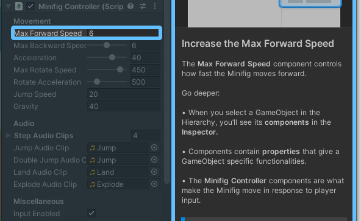

# Get started with Unity (September 2021)

> 설치 및 회원가입,  Unity Plan 정하기 등 기초 설정 및 Microgame을 따라해보며 학습을 시작하는 과정이다.

설치 등 기초적인 설정은 이미 되어있고, 간단하므로 생략했다.

## Microgame

> - Karting Microgame: a 3D racing game
> - 2D Platformer Microgame
> - FPS Microgame: a first-person shooter game
> - LEGO Microgame

Unity Hub에서 New Project를 누르고 Microgame을 검색하면 위의 네 가지 게임이 나온다. 최상단의 레고 게임을 골라 Download Template => Create Project를 해준다.

프로젝트 생성 이후 자동으로 실행되는데, 교보재답게 GUI를 통해 인터페이스를 익힐 수 있다.

##### Play

재생 버튼을 눌러 테스트를 위해 게임을 실행할 수 있다. 다시 누르면 빠져나오게 된다.

##### GameObject

프로젝트 내의 모든 것은 GameObject이다. `Hierarchy` 탭에서 GameObject를 관리할 수 있다.

앞서 PoseNet 예제를 미리 해보았는데, 사진에서 볼 수 있는 GameObject의 옵션들은 'Minifig Controller' 스크립트에서 정의되는 것 같다. 코드 및 내부 객체들은 개별 파일보다는 프로젝트 단위로 관리되는 것 같다.

##### Assets

하단의 Project 패널에서 Asset을 Scene view로 드래그&드랍하여 가져올 수 있다. Scene view에서는 `alt` + `LMB`로 시점을 조정할 수 있다. Move Tool로 추가한 asset을 움직일 수 있다. Rotate Tool로 회전할 수 있는데, 두 툴 모두 축이 3개임에도 조작이 굉장히 간편했다.

##### Unity Asset Store

Asset Store에서 원하는 에셋을 받고, Open in Unity를 눌러 package manager를 통해 임포트할 수 있다.

##### Build & Publish

Unity 커뮤니티 안에서 Webgl 방식으로 퍼블리싱을 지원하는 것 같다. 

생각보다 어린아이 용이라 큰 수확은 없었던 것 같다... 코딩과 관련된 학습도 많이 있으니 조금 더 찾아봐야 할 것 같다.
