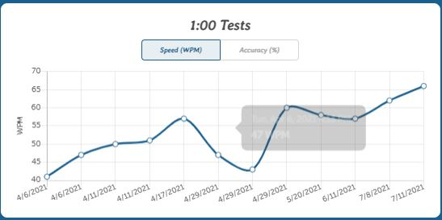
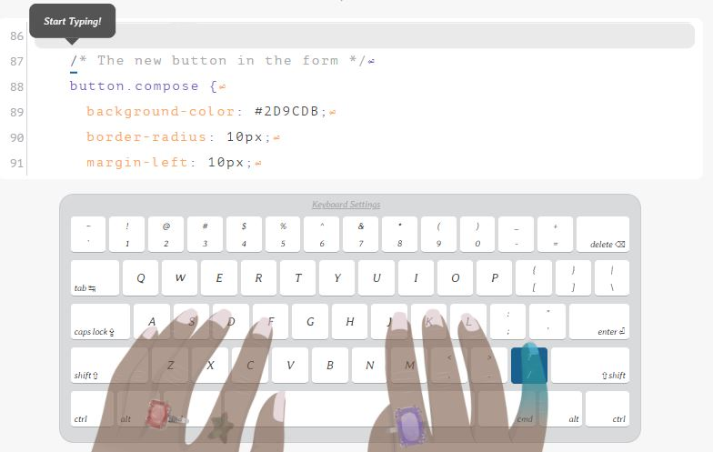

# 타자연습

한달에서 두달 가까이 쉬다싶이 했던 타자연습을 다시 해보았다. 또 예전에는 너무 단촐하게 사진만 올렸더니 내가 봐도 뭘 어쩌라는 건지 모르겠어서 앞으로는 역시 마법의 마크다운으로 정리할 것이다.

간만에 타자연습을 했더니 재밌어서 40분 가까이 타이핑을 했다.

올해 초만 해도 독수리타법에 영타가 느려 검지로 낑낑대며 `print('Hello World')`를 치던 기억이 나는데 역시 사람은 적응의 동물이다.

이렇게 html, css, javascript 예문도 있어서 시도해 보았는데, 너무 실용적이라 깜짝 놀랐다. 특히 {, }, ", /, <, >, * 등 프로그래밍 할때에만 많이 쓰는 기호들이 포함되다 보니, 지금 타자를 치는 방식의 문제점도 알 수 있었다. 여태까지는 소지는 시프트를 제외하고는 딱히 쓰는 일이 없었는데, 약지로 저 많은 기호들을 다 입력하려니 너무 불편해서 한번 소지를 써볼까 싶어 시도해 보았더니, 놀랍게도 +, ", ?, / 등을 누르는 데 너무 편하고 좋다는 걸 알게 되었다. 

P.S. `P` 또는 `ㅔ`는 교과서적으로는 소지를 사용하라고 되어 있는데, 실제 내 손으로는 약지가 너무 편해서 고민이 된다.