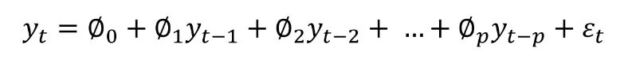
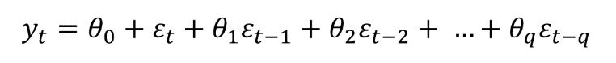
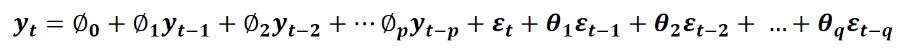

# ARIMA 모델 개요_1

> [(21) ARIMA 모델 개요 - Part 1 - YouTube](https://www.youtube.com/watch?v=ma_L2YRWMHI)

### 정상 프로세스 Stationary Process

시간에 관계없이 평균과 분산이 일정한 시계열 데이터

### 비정상 프로세스 Nonstationary Process

시간에 따라 평균 또는 분산이 달라지는 시계열 데이터

### 정상성의 확인

큰 데이터의 경우 육안으로 확인이 힘들 수 있음

- `Autocorrelation Function`의 패턴을 이용
  - Lag: 자기 시점보다 n시점 늦은 데이터
    - 1~20까지의 lag에 대해서 correlation을 측정

### Autoregressive Model (AR)

t시점의 y는 t시점부터 전 시점들(lag)의 y 데이터들로 이루어진다.

- 최소제곱법으로 parameter를 도출할 수 없음.

### Moving Average Model (MA)

t시점의 y는 t시점부터 전 시점들의 에러들로 이루어진다.

### Autoregressive and Moving Average Model (ARMA)

t시점의 y는 t시점부터 lag된 자신의 값과 에러들로 이루어진다.

### Autoregressive Integrated Moving Average (ARIMA)

AR, MA, ARMA 모델의 경우에는 데이터가 정상성(Stationary)을 갖추고 있어야 함.

- 정상성을 갖추지 않은 데이터를  `differencing`을 통해 정상성을 부여할 수 있음. (대표적인 방법)
  - ARIMA모델의 p, d, q 변수
    - p의 경우, AR모델의 parameter(independent variable)의 개수
    - g의 경우, parameter(ceta)의 개수
    - d의 경우, differencing 횟수

### 차분 Differencing

원본 데이터가 정상성을 갖췄다면, 차분은 필요하지 않다.

일정하게 증가하는 트렌드는 1차 차분으로 정상성을 얻을 수 있다.

복잡한 트렌드를 가진 데이터는 2차 차분으로 정상성을 얻을 수 있다.

만약 2차 차분으로도 부족하다면, ARIMA모델로 분석하기에 적합하지 않은 데이터일 수 있다.

