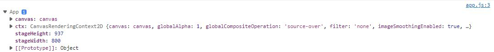

# 움직이는 웨이브 만들기

> [Creative Coding Tutorial : Moving wave with JavaScript - YouTube](https://www.youtube.com/watch?v=LLfhY4eVwDY)

유튜브 알고리즘에서 신기한 프로젝트를 많이 하신 Interactive Developer 님 채널을 발견해서, 직접 해보고 또 지금 학습중인 React로 옮겨보면 재미도 있고 실력도 늘 것 같아 도전해 보았다. 따라하며 자바스크립트 관련 모르는 부분이 나올 때가 많았는데, (JS class 문법, requestAnimationFrame 등등...) 같이 정리하면서 진행했다.


## app.js

```js
class App {
  constructor() {
    this.canvas = document.createElement('canvas');
    this.ctx = this.canvas.getContext('2d');
    document.body.appendChild(this.canvas);

    window.addEventListener('resize', this.resize.bind(this), false)
    this.resize();

    requestAnimationFrame(this.animate.bind(this));   
  }
    
  ...
  
  animate(t) {
    this.ctx.clearRect(0, 0, this.stageWidth, this.stageHeight);
    requestAnimationFrame(this.animate.bind(this))
  }
}  
```

1. 클래스의 생성자인 `constuctor() {}`

   파이썬의 `__init__`과 같다. 다만 `this` 키워드를 사용하여 'App' 클래스의 속성을 정의하였다.

   생성자 내부에서 console.log(this)를 찍으면 다음과 같다.

2. requestAimationFrame

   > [크로미움에서 requestAnimationFr.. : 네이버블로그 (naver.com)](https://blog.naver.com/coleea2/222334692864)

   위의 블로그에 자세한 설명이 나와있다. 축약하면 `setTimeout`으로 구현하는 애니메이션이 한계가 있어 새로 등장한 녀석이며, 모니터가 화면을 한번 주사할 때마다 내뿜는 `vsync pulse`를 기반으로 작동한다. 애니메이션을 위한 콜백함수를 호출할 때 사용하는 메서드이다.

   > MDN: The **`window.requestAnimationFrame()`** method tells the browser that you wish to perform an animation and requests that the browser calls a specified function to update an animation before the next repaint. The method takes a callback as an argument to be invoked before the repaint.

현재 animate 함수 내부에 들어있는 코드는 캔버스를 클리어하는 코드이다.


## point.js

```js
export class Point {
  constructor(x, y) {
    this.x = x;
    this.y = y;
    this.fixedY = y;
    this.speed = 0.1;
    this.cur = 0;
    this.max = Math.random() * 100 + 150;
  }

  update() {
    this.cur += this.speed;
    this.y = this.fixedY + (Math.sin(this.cur) * this.max);
  }
}
```

싸인함수가 -1부터 1까지의 값을 가진다는 것을 이용하여 한 점이 가지는 y좌표를 위아래로 움직여주는 코드이다.


