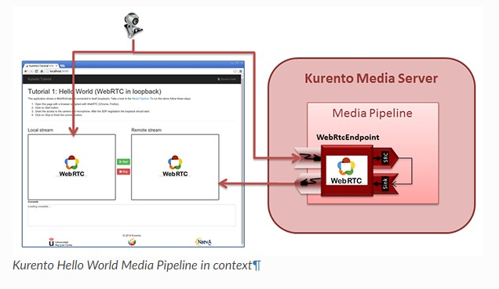

[JavaScript - Hello world — Kurento 6.16.1-dev documentation (doc-kurento.readthedocs.io)](https://doc-kurento.readthedocs.io/en/latest/tutorials/js/tutorial-helloworld.html)


Kurento는 Kurento Media Server를 제어하기 위한 Kurento JavaScript Client를 제공해주기 때문에 javascript로 어떻게 KMS를 제어하는지를 알아보는 튜토리얼이다.

- 'Docker'에서 KMS가 담긴 컨테이너를 미리 실행시켜 두어야 실습을 진행할 수 있다.

  - [Installation Guide — Kurento 6.16.1-dev documentation (doc-kurento.readthedocs.io)](https://doc-kurento.readthedocs.io/en/latest/user/installation.html)에서 `Docker image` 부분을 따라한 후 

    ```powershell
    docker run --rm \
        -p 8888:8888/tcp \
        -p 5000-5050:5000-5050/udp \
        -e KMS_MIN_PORT=5000 \
        -e KMS_MAX_PORT=5050 \
        kurento/kurento-media-server:latest
    ```

    위의 명령어를 실행하면 된다.


'튜토리얼 1'에서는 두개의 html `video` 태그를 확인할 수 있는데, 하나는 로컬 stream, 다른 하나는 media server를 통해서 client로 보내진 원격 stream이다.

- 로컬 stream이 Kurento Media Server로 보내지면, 서버는 추가적인 수정 없이 해당 stream을 다시 client에게 보내주는 구조이다.
  - 해당 작업을 하기 위해서는 양방향 WebRTC 미디어 플로우의 전송을 가능하게 하는 `WebRtcEndpoint` 라는 html Media Element가 필요하다.
    - 이 예제에서 해당 media element는 스스로에게 연결되어, 브라우저에서 수신한 media를 다시 같은 브라우저로 보내주게 된다.




