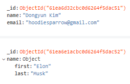

MongoDB Atlas (cloud) 

- tutorial project 생성
  - freetier cluster 생성
    - ip / user 설정 (admin/gyfhUCt8q8BwFjIK)
  - MongoDB Compass 다운로드
    - connection string을 사용하여 DB에 연결
    - Compass 좌하단의 MongoSH 쉘을 사용

# Create

첫 db의 이름은 `test`

`> use blog` : blog db로 전환 / 이때 db가 생성되지 않으며 데이터가 쓰일 때 db가 자동으로 생성됨

`> db.users.insertOne({ name: "Dongyun Kim", email: "hoodiesparrow@gmail.com"})` 

- 새로고침시 `blog` 데이터베이스와 내부에 `users` 라는 컬렉션이 생성된 것을 볼 수 있음

- 이름과 이메일만 입력했지만, `_id` 속성으로 키가 생성된 것을 볼 수 있음. MongoDB에서 자체적으로 부여하는 키이며, RDB에서의 PK와 비슷

  

  - `db.users.insertOne({ name: { first: "Elon", last: "Musk" }})` 
    - Schemaless : 미리 짜여진 스키마에 맞게 데이터를 입력하는 RDB와 다르게, 데이터의 형태가 정해져 있지 않음

Note: JSON과 비슷한 형태지만 성능이 개선된 BSON을 사용

# Update

`> db.users.updateOne({ name: "Dongyun Kim" }, { $set: { age: 30 } })`

- 인자를 두개 받으며, 앞의 인자는 Select의 역할을, 뒤의 인자는 수정할 내용에 대한 정보를 담는다

`> db.users.findOne({ name: "Dongyun Kim"})` 을 통해 추가된 age를 확인할 수 있다

##### Nested Document

`> db.users.updateOne({ "name.first": "Elon" }, { $set: { "name.last": "musk2" } } )`

- 크게 다른 점은 없지만, 뎁스가 있어서 `.`을 붙일 때는 `""`를 붙이는 점에 유의 (SyntaxError)

##### With ObjectID

강의에서는 `db.users.findOne({ _id: ObjectId("61ea6d32cbc0d6264f5dac51") })` 구문을 입력했을 때 오류가 났지만, 버전이 달라서 그런지 문제없이 작동했다.

다만 `let objectId = require('mongodb').ObjectID` 구문을 터미널에 입력해서 해결했는데, 자바스크립트로 돌아가고 있다는 걸 볼 수 있었다.

`db.users.updateOne({ _id: ObjectId("61ea6d32cbc0d6264f5dac51") }, {$inc: { age: 1} })`

- ID로 접근하여 수정/$inc로 1 증가

# Delete

`db.users.deleteOne({ _id: ObjectId("61ea6d32cbc0d6264f5dac51") })`

## 데이터베이스 구조

- SQL 기반 데이터베이스에서의 테이블 => Collection
- row (tuple) => Document