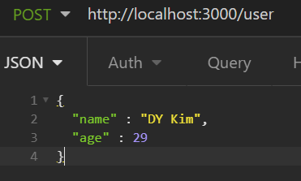

`$ npm init`

`express` 설치

`nodemon` 사용


# API 만들기

```js
const express = require('express')
const app = express()

app.get('/user', (req, res) => {
  return res.send({users: []})
})

app.listen(3000, () => console.log('server listening on port 3000'))
```

- `app` 뒤의 메서드는 http 메서드
  - `req` 에는 요청받은 데이터가 들어있음
  - 응답은 `res` 인자의 `send` 메서드 활용


```js
...
const users = []

app.post('/user', (req, res) => {
  users.push({name: req.body.name, age: req.body.age})
  return res.send(true)
})
...
```



`/user` POST 엔드포인트를 만들어두고 이런 요청을 보내게 되면, `TypeError: Cannot read property 'name' of undefined` 라는 에러를 출력한다.

- 당연히 파싱되지 않은 JSON이므로 제대로 데이터가 들어있는 객체가 아님. 
  - `express`의 미들웨어를 통해 편리하게 파싱 가능
  - `app.use(express.json())` 어디선가 많이 본 것 같은 `app.use`를 통해 미들웨어를 등록할 수 있다.