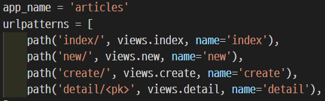
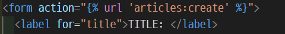
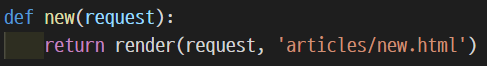
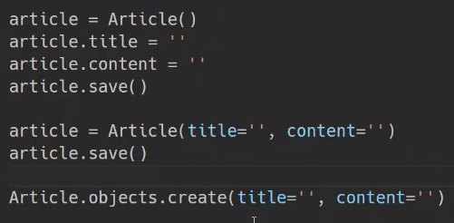

## Django

**python** 기반의 web framework이다. 클라이언드와 서버를 모두 다룰 수 있어 Dynamic web을 만들 수 있다.

보통의 MVC (Model View Control) 모델과 구조는 동일하지만 부르는 명칭이 MTV (Model Template View)로 약간 다르다. 따라서 HTTP Request가 들어오면 Urls를 거쳐 View에서 필요하다면 데이터베이스에서 정보를 받아 View에 정보를 담아 회신한다.

Django의 기본 철학은 표현과 로직을 분리하는 것이다. 따라서 Templates에서는 표현만 하고, 로직은 view에서 처리하는 것이 제작 의도를 따르는 코딩 방법이 될 것이다. 또한 Template에는 상속을 통해 중복을 배제하고자 하는 목적이 담겨있다. (대부분의 웹사이트는 navbar, header, footer 등 사이트 내 다른 페이지들 간에 공유되는 공통 디자인을 갖는다.)


Django로 프로젝트를 생성하고 초기 설정을 하는 방법은 아래와 같다.


**\# 프로젝트  생성**

$ django-admin startproject projectName

$ cd projectName

$ python manage.py runserver

> 구동되는 것을 확인한다.


**\# Locale & Timezone**

`projectName / projectName / settings.py`

LANGUAGE_CODE = '**ko-kr**'

TIME_ZONE = '**Asia/Seoul**'


**\# application 생성**

$ python manage.py startapp applicationName  # applicationName should be in plural form. e.g.) article**s**

`projectName / projectName / settings.py` 

INSTALLED_APPS = [

  'applicationName',

> The order for INSTALLED_APPS goes 1. local apps 2. 3rd-party apps 3. django apps


**\# 템플릿 확장 (setting base.html)**

choose where to store base.html: 설정폴더 또는 프로젝트폴더

make a new directory (projectName / **templates**)

`projectName / projectName / settings.py` 

TEMPLATES = [

  { ...

​    'DIRS': [**BASE_DIR / 'templates'**],

> BASE_DIR = root

`projectName / templates / base.html`





> 여러 개의 블록이 있을 수 있으며, body안의 내용을 담당하는 블록은 보통 content 또는 body이름 부여


**\# URL분리**

`projectName / projectName / urls.py`

>  urls.py **상단의 주석**을 참조 !!

from django.urls import path**, include**


`projectName / applicationName / urls.py (create)`

from django.urls import path

from . import views

> 현재 파일이 있는 디렉토리에서 views를 가져온다.

**urlpatterns** = [ 

​	path('**pageName/**', **views.pageName**)

]

> 여기서는 views 안에 있는 함수를 호출하는 것이기 때문에 String이 아님.


`projectName / projectName / urls.py`

 path('applicationName/', include('**applicationName.urls**'))

> include 내부에는 String으로 인자를 넘겨준 것에 유의하자. applicationName.urls라는 변수는 없고 파일명을 넘겨준다고 생각하면 된다.


`projectName / applicationName / templates (create) / pageName (create)`





> 이곳에 개별 내용을 넣는다.




`projectName / applicationName / views.py`

def **pageName**(request):

somethinginformation = ...

content = {

​	'key': value

}

  return render(request, **'pageName.html'**, content)

> 역시 파일명이므로 따옴표를 붙인다. 데이터를 같이 넘긴다면 content 딕셔너리에 담아 인자로 content만 넘기게 되면 html에서는 간단하게 {{ variableName }} 으로 사용할 수 있다.


**# Variable Routing**

`urls.py` 

`path('hello/<str:name>/', views.hello)`


`views.py` 

`def hello(request, name):`

매개변수의 이름은 `urls.py` 에서 정의한 변수명과 같아야 한다.

`str` 은 기본값으로, 생략가능: `<name>`

정수는 `int` 로 표현 `<int:age>`

> 변수를 매개변수로 만들어서 받아준다.


**# URL Namespace**



`appName / urls.py`

path 함수의 세번째 자리에 name='urlName'의 형태로 작성한다.

경로가 필요한 부분에 `` 의 형태로 사용하면 되나,

어플리케이션이 다양해지는 경우 'index' 페이지 같이 흔히 쓰이는 페이지는 동일한 별명이 있을 수 있음.

이러한 경우 어떤 url인지 구별이 힘든 데, 이런 단점을 해결하기 위해서 상단의 `app_name`을 appName과 똑같이 할당해준다.

이렇게 `app_name`을 할당한 뒤에는 



이런 식으로 ``의 형태로 사용하면 된다. 쌍따옴표 안에서 태그가 시작되는 것에 유의.


**# Template Namespace**

바로 위의 경우처럼 어플리케이션이 다양해지는 경우 html의 이름이 같은 경우가 생기는데, django는 `projectName / projectName / settings.py / INSTALLED_APPS` 에서 등록된 순서대로 templates 폴더를 탐색하기 때문에 어떤 어플리케이션의 template 파일인지 구분을 할 수 가 없게 된다.

이런 경우 templates 폴더 내부에 해당 어플리케이션 이름으로 폴더를 하나 더 작성하고,

이렇게 `appName / pathName.html`로 호출하여 다른 어플리케이션의 페이지를 불러오는 것을 방지한다.


**# ORM**

DB에서 쓰는 SQL과 python은 서로 언어가 달라서 api가 필요한데, django에서는 `ORM`을 사용하여 python과 SQL을 상호간에 번역한다. 

이 `ORM`은 SQL을 잘 알지 못하더라도 DB조작이 가능하고 기존 SQL의 절차적 접근이 아닌 OOP적 접근으로 인한 높은 생산성을 누릴 수 있지만, `ORM`만으로는 완전한 서비스를 구현하기 어려운 경우가 있다는 한계점 또한 가지고 있다.

간단하게 테이블은 field=column=속성, record=row=tuple, 개별 record에 대응하는 각각의 field가 가지는 값, 그리고 필드중 하나인 primary key로 이루어져 있다.

`projectName / appName / models.py`

```python
class Tablename(models.Model):  # Tablename should be in singular form

    fieldName = models.FieldType(option)

    fieldName = models.FieldType(option)
```

이렇게 appName을 단수형으로 만든 이름을 사용하여 `class`를 만들고, 상속을 통해 편리하게 데이터베이스의 스키마를 만들 수 있다.

- `FieldType`은 모두 `upper camel case`로 되어 있는데, 여기서 이 필드 타입들은 결국 `models` 안에 존재하는 클래스라는 것을 알 수 있다.


**# Migrations**

`projectName / appName / models.py`에서 만든 스키마를 바탕으로, DB설계도처럼 동작하는 SQL구문으로 이루어진 **migration**파일을 생성하기 위해서는 `python manage.py makemigrations`를 터미널에 입력한다.

이 단계에서는 아직 데이터베이스에 해당 변경점이 반영되지는 않고, 다만 그에 대한 정보를 포함하는 migration 파일이 생성된다.


이후 실제로 migration 파일의 내용을 DB에 반영(`models.py`의 변경사항과 DB의 스키마가 동기화)하기 위해서는  `python manage.py migrate`를 터미널에 입력한다.

이제는 DB에 실제로 변경사항이 반영된다.


추가 명령어들) 

migration 파일 안에 담겨있는 SQL 구문을 보기 위해서는, `python manage.py sqlmigrate appName 0001`을 입력하는데, 이때 0001은 알고자 하는 migration 파일의 번호를 입력하는 부분이다.


`migrate` 이후 실제 마이그레이션 여부를 확인하기 위해서는 `python manage.py showmigrations`를 터미널에 입력한다. 이때 [X]로 표기되는 테이블은 반영이 되었다는 표시이므로 혼동하지 말자.


**# Database API**

ORM에서 제공하는 DB를 조작하기 위한 도구이다. CRUD를 통해서 Database API에 대해서 알아보자.

우선 DB에 데이터를 생성하는 `Create`의 경우, 



3가지의 방법이 존재한다.

첫번째와 두번째 방법의 경우 `article`을 `Article` 클래스(`Article`은 테이블의 이름이기도 하다)의 인스턴스로 만들어 정보를 넣고 저장하는 순서만 다른 방법이고, 세번째 방법은 `create()`라는 메서드를 활용하는 방법이다.


**# GET vs POST**

GET: 데이터를 조회할 때만 사용

POST: 데이터를 수정, 생성, 삭제할 때 사용하며, `form` 아래에서 `{{ csrf_token }}`구문을 추가하여 CSRF 스크립트 공격을 방지한다. 여태까지는 글을 작성할 때에 `GET` 메서드를 사용했지만, 데이터가 수정되는 모든 경우에는 `POST` 메서드를 사용해야 한다.


**# CRUD**

**CREATE**

- template

```html
<form action="" method="POST">
  
```

- views.py

```python
def create(request):
    article = Article()

    title = request.POST.get('title')
    content = request.POST.get('content')

    article.title = title
    article.content = content
    article.save()

    return redirect('articles:detail', article.id)
```

\# `ariccles:create`로 쿼리(주소에서, ? 이후)에 정보를 담아 보내면, `create` 함수에서 DB에 저장한 후

​	`detail` 페이지를 호출한다.

**# Variable Routing에서, 받는 부분 대신 보내는 부분이다.** (views.py에서)

동시에 variable routing을 위해서 두번째 인자로 `articles.id`를 보내준다.


​	**+) RETURN vs REDIRECT**

​	`new` 페이지에서 글을 작성(action="``" method=POST )한 후 

​	작성한 글의 내용을 보여주는 `detail` 페이지로 가고자 한다면,

​	`render`를 통해서는 해당 페이지를 보여 줄 수가 없다. 

​	<이유 추가>


`detail` 페이지의 `path`는 아래와 같은데,

```python
path('detail/<int:id>/', views.detail, name='detail')
```

여기서 variable routing으로 받은 id를 주소로 받아 다시 `views.py `의 `detail `함수에서

```python
article = Article.objects.get(pk=id)
```

구문을 통해 id가 같은 인스턴스, 즉 해당하는 글을 가져올 수 있게 된다.


**READ**

```python
article = Article.objects.get(pk=id)
```

\# 위에서 확인한 코드에서 READ를 엿볼 수 있다. `Article` 클래스에 대해서 특정 id를 가지는 유일한 객체를 리턴하는 `.get()` 메서드, `Article` 클래스에 대해 모든 인스턴스를 리턴하는 `.all()` 메서드, 마지막으로 `field lookups` 를 통해 특정 조건을 가지는 객체(0개, 1개, 여러개 가능)를 리턴하는 `.filter()`메서드가 READ에 해당한다.


**UPDATE**

UPDATE는 CREATE와 많은 공통점을 지닌다. 작동 프로세스를 살펴보자면 우선 객체를 읽어온 후, 변동되는 값을 대입하고 저장한다. CREATE는 신규 객체에 값을 저장하는 반면, UPDATE는 기존 객체를 수정한다는 점이 다르다는 걸 알 수 있다.

`detail` 페이지의 html에서,

```python
<a href="">EDIT</a>
```

​	**# Variable Routing에서, 받는 부분 대신 보내는 부분이다.** (html에서)

​	`url` 태그에서 한 칸을 띄운 다음 보낼 변수명(여기서는 article 인스턴스의 id에 해당하는 값을 담은 변수이다)을 	적고, 한 칸을 다시 띄워 마무리한다.


역시 `edit`의 `path`를 살펴보면 

```python
    path('edit/<int:id>/', views.edit, name='edit')
```

`<int:id>` 구문을 통해 Variable Routing을 주소로 받아주고 있다.


이후 `views.py`에서도

```python
def edit(request, id):
    article = Article.objects.get(pk=id)
    context = {
        'article': article,
    }
    return render(request, 'articles/edit.html', context)
```

차근차근 변수를 받아 원하는 값을 가져오는 단계를 훑어볼 수 있다.


 context로 넘겨준 값에 의해 `edit.html`에서도 

```html
  <label for="title">TITLE:</label>
  <input type="text" name="title" id="title" value={{ article.title}}>
  <label for="content">CONTENT:</label>
  <textarea name="content" id="content" cols="30" rows="10">{{ article.content }}		   </textarea>
```

value 태그와 {{ article.content }}변수를 통해 사용자가 이전에 작성했던 값을 미리 채워줄 수 있다.


**DELETE**

다른 CRU에 비해 DELETE는 간단하게 그 작업이 끝난다.

삭제하고자 하는 인스턴스를 불러온 후, `instanceName.delete()` 메서드를 통해 삭제하면 DB에서 해당 객체는 삭제된다. 만약 id=1인 객체가 삭제된다고 해서 새로이 생성되는 객체가 다시 id=1을 가지지는 않는다는 점에 유의하자.


**# FORM**

`articles / forms.py`

```python
from django import forms

class ArticleForm(forms.form):
    title = forms.CharField(max_length=20)
    content = forms.CharField(widget=forms.Textarea)
```

