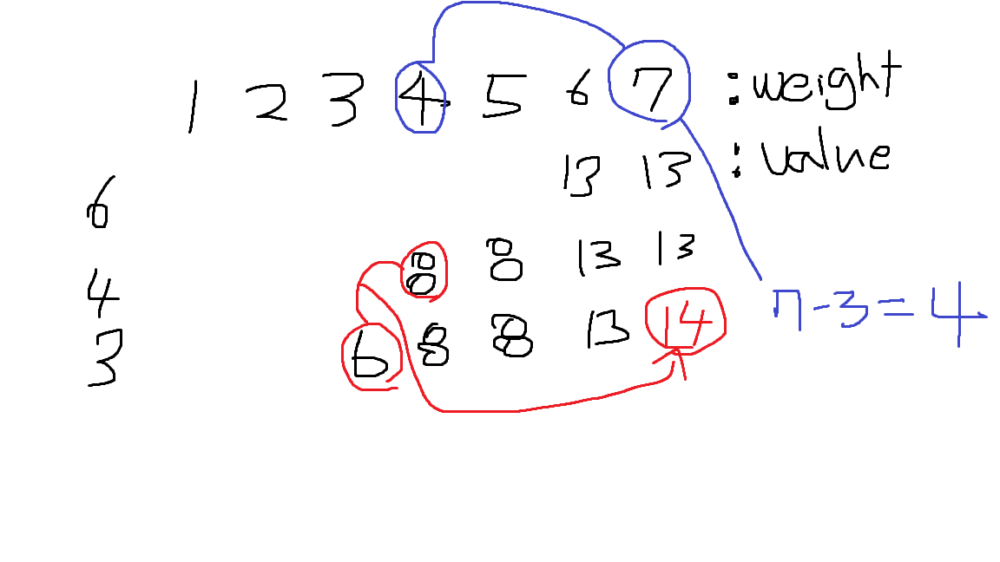

# 12865. 평범한 배낭

> | 시간 제한 | 메모리 제한 | 제출  | 정답  | 맞은 사람 | 정답 비율 |
> | :-------- | :---------- | :---- | :---- | :-------- | :-------- |
> | 2 초      | 512 MB      | 31484 | 11987 | 7925      | 36.432%   |
>
> ## 문제
>
> 이 문제는 아주 평범한 배낭에 관한 문제이다.
>
> 한 달 후면 국가의 부름을 받게 되는 준서는 여행을 가려고 한다. 세상과의 단절을 슬퍼하며 최대한 즐기기 위한 여행이기 때문에, 가지고 다닐 배낭 또한 최대한 가치 있게 싸려고 한다.
>
> 준서가 여행에 필요하다고 생각하는 N개의 물건이 있다. 각 물건은 무게 W와 가치 V를 가지는데, 해당 물건을 배낭에 넣어서 가면 준서가 V만큼 즐길 수 있다. 아직 행군을 해본 적이 없는 준서는 최대 K만큼의 무게만을 넣을 수 있는 배낭만 들고 다닐 수 있다. 준서가 최대한 즐거운 여행을 하기 위해 배낭에 넣을 수 있는 물건들의 가치의 최댓값을 알려주자.
>
> ## 입력
>
> 첫 줄에 물품의 수 N(1 ≤ N ≤ 100)과 준서가 버틸 수 있는 무게 K(1 ≤ K ≤ 100,000)가 주어진다. 두 번째 줄부터 N개의 줄에 거쳐 각 물건의 무게 W(1 ≤ W ≤ 100,000)와 해당 물건의 가치 V(0 ≤ V ≤ 1,000)가 주어진다.
>
> 입력으로 주어지는 모든 수는 정수이다.

```python
N, K = map(int, input().split())


# 첫 행을 편하게 계산하기 위해서 (row + 1), (column + 1)의 크기를 가지는 배열 선언

dp = [[0] * (K + 1) for n in range(N + 1)]
for r in range(1, N + 1):
    W, V = map(int, input().split())
    for c in range(1, K + 1):
        if c >= W:
            if dp[r - 1][c] < dp[r - 1][c - W] + V:
                dp[r][c] = dp[r - 1][c - W] + V
            else:
                dp[r][c] = dp[r - 1][c]

        else:
            dp[r][c] = dp[r - 1][c]

print(dp[N][K])
```

DP 초급 문제이다.

- 1부터 무게 상한까지의 각 무게 정수에 대해 해당 무게로 얻을 수 있는 최대의 가치를 저장하는 게 기본 컨셉트이며,

  - 여기서 2차원 배열의 column에는 무게 정수(1, 2, 3, 4, ... , K), row에는 모든 물건을 차례대로 대입하며, 모든 row에 대해서 앞에서 서술한 작업을 반복하게 되면, 가장 마지막 행에서 주어진 조건에서 얻을 수 있는 가장 큰 가치를 찾아낼 수 있다.
- 값을 저장할 때는, 어떤 무게에 대해서 여태까지 가장 높은 가치를 지닌 값(바로 위의 행의 값)과 현재의 물건을 고려했을 때 가능한 가장 높은 가치를 비교하여 더 높은 값을 저장한다. 여기서 주의할 점은, 만약 현재 고려하는 무게의 상한이 7이고 현재 고려중인 물건의 무게가 3이라면, 무게의 상한이 4일 때의 최댓값 (바로 위의 행의 값)을 더하여 비교해야 한다는 점이다.
  - 그림으로 해당 로직을 나타내면,




한가지 주의할 점은, 하나의 물건이 두번 들어가지 말아야 하기 때문에 해당 행이 아닌 바로 위의 행에서 값을 가져와야 한다는 점이다.

```python
            if dp[r - 1][c] < dp[r - 1][c - W] + V:
                dp[r][c] = dp[r - 1][c - W] + V
```

로직을 짤 때는 그 부분을  생각했지만, 실제 구현중에선 `dp[r ][c - W] + v` 를 입력하여 실패한 뒤 오류를 찾을 수 있었다. 