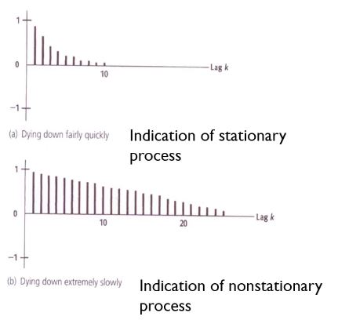
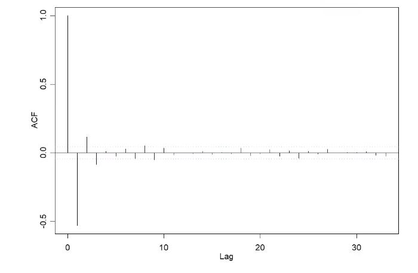
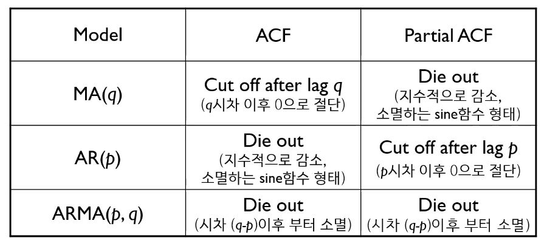
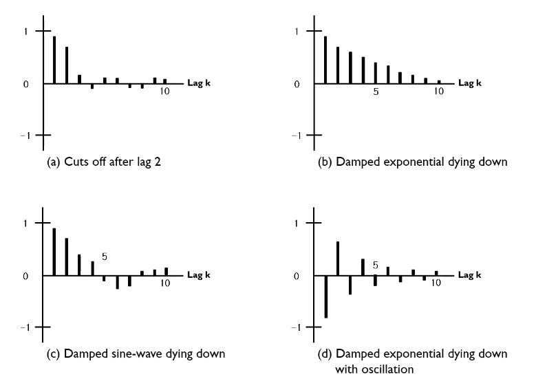
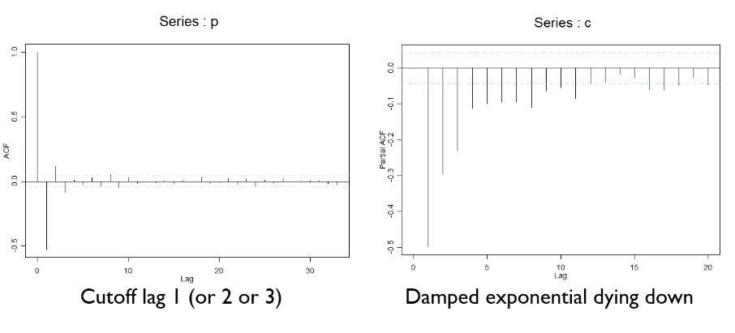
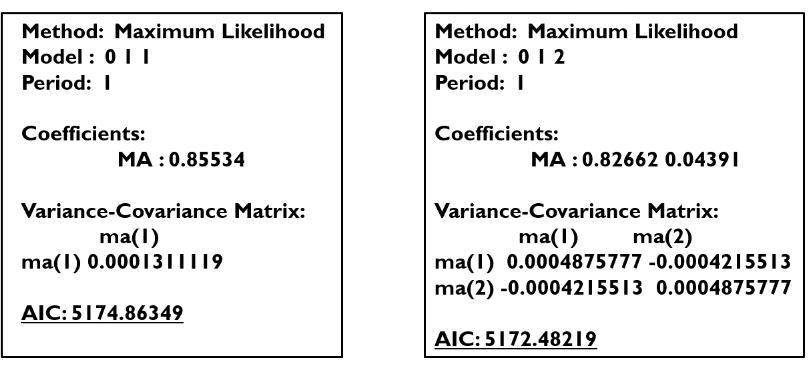
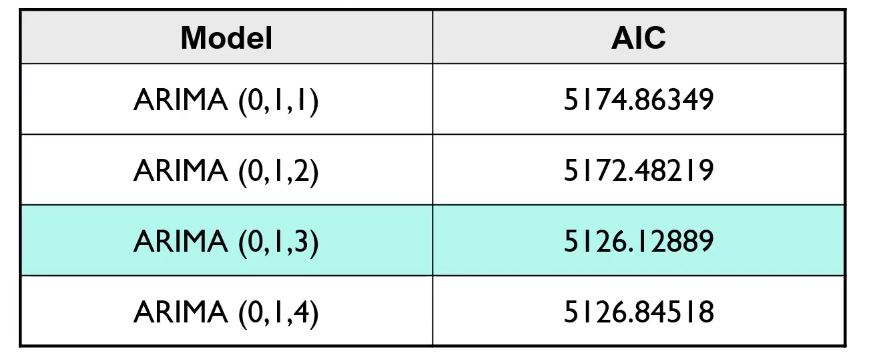
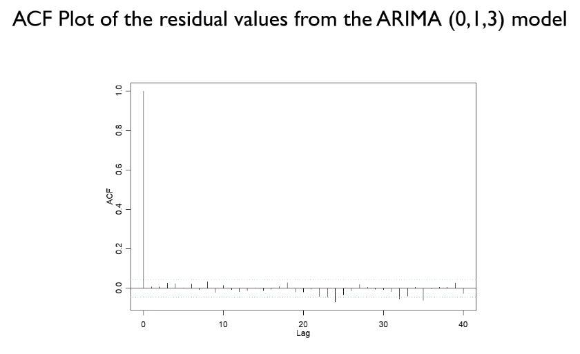

# ARIMA 모델 개요_2

> [(21) ARIMA 모델 개요 - Part 2 - YouTube](https://www.youtube.com/watch?v=P_3808Xv76Q)

### Box-Jenkins ARIMA Procedure

1. Data Preprocessing
   - 정상성 확인: Autocorrelation Function
   - 
     - 값이 천천히 떨어지는 경우, 비정상 프로세스로 판단할 수 있음.
       - 비정상 데이터: 정상성 부여(transformation, differencing)
       - 
       - differencing 이후 정상성이 부여된 데이터
2. Identify Model to be Tentatively Entertained
   - 임시 모델 찾기
     - 
     - ACF와 PACF의 패턴을 육안으로 확인한 뒤 데이터에 적합한 모델을 사용하기.
     - 
     - 
     - 해당 데이터에서는 MA모델이 적합!
     - 
     - Model의 값들은 p, d, q에 대응
     - 1차 차분했기 때문에 d = 1
     - 그래프상으로는 q = 1이 적합해 보임.
     - 
     - 실제 근방의 값들을 적용하면 0, 1, 3이 AIC가 가장 낮음
       - AIC: 모델의 성능을 판단하는 척도, 낮을수록 좋음
3. Estimate Parameters
   - 변수 추정
4. Diagnosis Check
   - 적합성 판단
     - 임시 모델로 데이터를 예측한 뒤, ŷ-y (residuals)에 대해 ACF plot을 그려본다.
     - 40개 중 2~3개가 경계 밖으로 벗어나거나 하나가 크게 벗어나는 것은 허용된다.
     - 
     - 0을 제외하고 2~3개 정도가 벗어나기 때문에 적합한 모델이라고 할 수 있다.
5. Use Model to Forecast
   - 찾은 모델로 예측하기

p, d, q의 결정

- 위처럼 Graphical한 데이터를 보고 주관적으로 결정할 수도 있지만,
  - 경우의 수들을 테스트 해본 후 AIC, Testing Data의 정확성 등을 참조하여 결정할 수도 있다.

